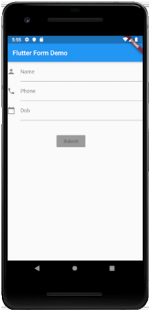

# Exercício 1 - Flutter Form Demo

1. Implemente um ***Form*** como na imagem abaixo. Busque mesclar ***Column*** com ***Row*** para obter o layout apresentado.  
Mostre em um ***SnackBar*** os dados inseridos quando o botão *Submit* for pressionado.

  

