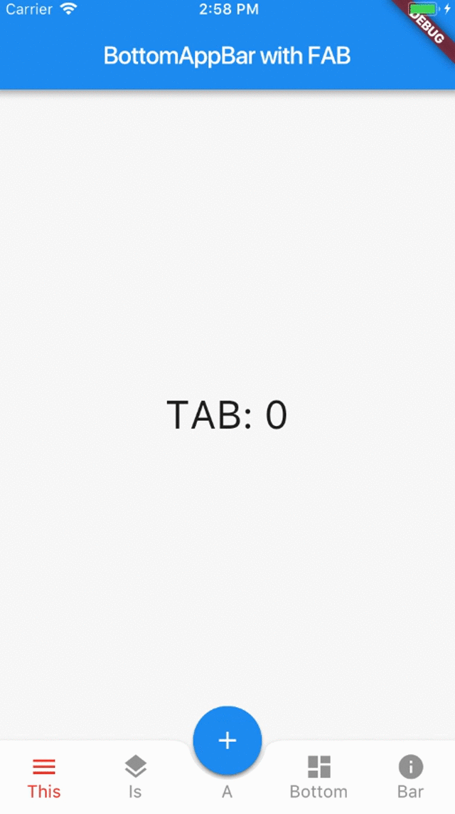

# Exercício 2 - BottomAppBar with FAB

2. Você sabia que o ***FloatingActionButton*** (também
conhecido como FAB) pode ser posicionado ao meio
de um ***BottomBarNavigation***?
Verifique que ao selecionar o FAB, novas opções são
apresentadas. Implemente também esse recurso. 

  

